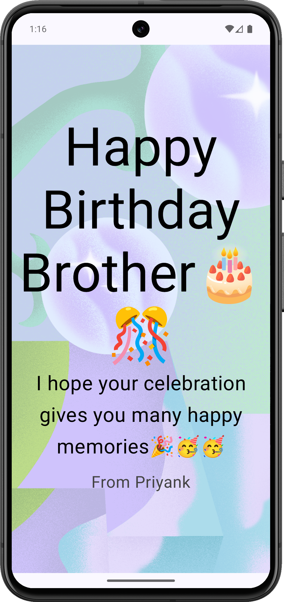

# 🎂 Birthday Card App

A simple Android app built using **Jetpack Compose** that displays a birthday greeting with a background image and message.

---

## 📱 Features

- Jetpack Compose UI
- Background image with overlay text
- Localized string resources
- Clean Material 3 design
- Simple and beginner-friendly structure

---

## 🧱 Built With

- [Kotlin](https://kotlinlang.org/)
- [Jetpack Compose](https://developer.android.com/jetpack/compose)
- [Material 3](https://m3.material.io/)
- Android Studio Hedgehog or newer

---

## 🖼️ Screenshot

| Main Screen |
|-------------|
|  |
> _Tip: You can take a screenshot from the emulator or preview window and save it as `preview.png`._

---

## 🚀 Getting Started

### Prerequisites

- Android Studio installed (latest version recommended)
- Kotlin plugin
- Android SDK 33+

### Installation

1. Clone the repository:
   ```bash
   git clone https://github.com/Priyank98p/birthday-card-app.git
   ```
2. Open the project in Android Studio.
3. Connect an Android device or emulator.
4. Click **Run** or press **Shift + F10**.

---

## 📁 Project Structure

```
com.example.birthdaycard/
│
├── MainActivity.kt           # Main entry point
├── GreetingText()            # Composable for text content
├── GreetingImage()           # Background image with overlaid text
└── res/
    ├── drawable/
    │   └── androidparty.jpg  # Background image
    ├── values/
    │   └── strings.xml       # Localized string resources
    └── themes/
        └── themes.xml        # Material 3 theming
```

---

## 🙌 Acknowledgments

- Background image by [Natalie Bond](https://www.pexels.com/photo/bunch-of-colorful-balloons-3371094/) via Pexels
- Made with ❤️ using Kotlin & Jetpack Compose

---

## 📄 License

This project is for educational/demo purposes and is not licensed for commercial use by default.
